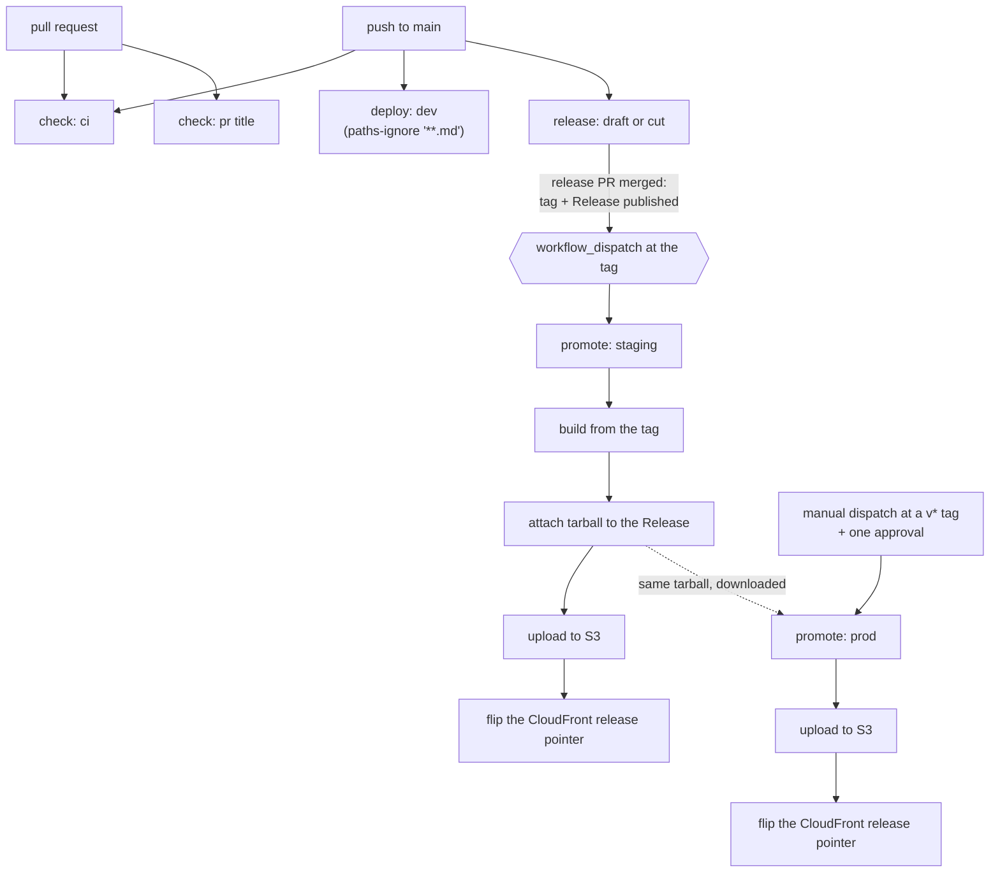

# Workflows

What runs, when it runs, and who starts it. Six workflows, all of them entry points: unlike the
backend, the frontend has no reusable `deploy-ecs.yml`, so there is nothing here marked internal.

## The files

| File | Name | Trigger | Kind |
| --- | --- | --- | --- |
| `ci.yml` | `check: ci` | `pull_request`, `push` to `main` | entry point |
| `pr-title.yml` | `check: pr title` | `pull_request` (`opened`, `edited`, `reopened`, `synchronize`) | entry point |
| `deploy-dev.yml` | `deploy: dev` | `push` to `main` with `paths-ignore: '**.md'`, `workflow_dispatch` | entry point |
| `promote-staging.yml` | `promote: staging` | `workflow_dispatch` at a `v*` tag, normally raised by `release.yml` | entry point |
| `promote-prod.yml` | `promote: prod` | `workflow_dispatch` at a `v*` tag, plus one approval | entry point |
| `release.yml` | `release: draft or cut` | `push` to `main` | entry point |

## The graph



Read in words:

- **A pull request** starts `ci.yml` and `pr-title.yml`.
- **A push to `main`** starts `ci.yml`, `deploy-dev.yml` (skipped when the commit only touches
  Markdown, via `paths-ignore: '**.md'`) and `release.yml`.
- **`release.yml`**, when the release-please pull request merges, commits the version, creates the
  tag and publishes the GitHub Release, then dispatches `promote-staging.yml` at that tag. It does
  **not** call `deploy-dev.yml`. The release commit touches `package.json`, so the push to `main`
  has already fired `deploy-dev.yml` on its own, and there is nothing to sequence.
- **`promote-staging.yml`** builds from the tag, attaches the tarball to the Release, uploads to S3
  and flips the CloudFront release pointer.
- **`promote-prod.yml`** is manual only: dispatch it at a `v*` tag and one approval on the
  `esa-eve-prod` environment. It downloads that same tarball and republishes it. It never builds.

## Where the rebuild happens

The frontend is the one place in the stack where a rebuild happens between environments, and it
happens at the staging hop. `deploy-dev.yml` builds for dev, and `promote-staging.yml` builds again
from the tag, because a Vite build inlines `VITE_*` values as constants: the version and commit
shown in the login page footer have to be baked in at the tag, not at the dev commit.

Production then republishes those exact bytes. `promote-prod.yml` downloads the tarball staging
attached to the Release and refuses to run if that asset is missing, so what production serves is
byte for byte what staging served. Everything that genuinely differs per environment (feature
flags, the three ESA links) is injected after the download by the `inject-runtime-config` composite
action, not compiled in.

## Naming

Workflow names follow `Category: Detail`, dotnet/runtime style. The Actions sidebar sorts
alphabetically, so this groups checks, deploys, promotions and releases:

```
check: ci
check: pr title
deploy: dev
promote: prod
promote: staging
release: draft or cut
```

The backend also carries an `internal:` category for its reusable workflow. GitHub cannot hide
reusable workflows from the sidebar (an open feature request since 2022, still unimplemented, and
workflow subdirectories are unsupported), so marking the `name` field is the only fix. The frontend
has no reusable workflow, so that category is unused here.
