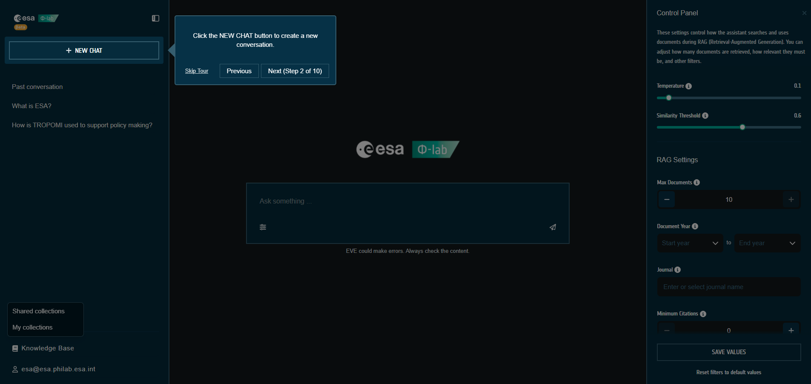
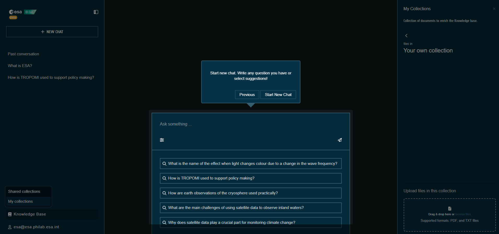

# Chat

EVE’s chat is a multi-turn assistant focused on Earth Observation topics. Messages render Markdown/KaTeX, stream in real time, and include source citations when RAG is used.

## Layout
- **Conversations sidebar (left)**: start a new chat, browse history, rename or delete conversations. On mobile, tap the burger icon to toggle it.
- **Chat area (center)**: message list with streaming answers. Retry is offered on errors; “Show more/less” expands long prompts.
- **Dynamic sidebar (right)**: opens contextual panels such as Sources, Control Panel, Shared collections, and My collections.

## Start a conversation
1. Click **NEW CHAT** in the conversations sidebar.
2. Type your question and press Enter (or click the send icon).
3. Continue the discussion; history stays linked to the conversation.

## Working with messages
- **Sources**: when a reply uses retrieved documents, click **Sources (n)** in the message footer to inspect the cited snippets.
- **Feedback**: thumbs up/down to rate answers; optionally leave a reason for negative feedback.
- **Copy**: copy any reply text directly from the footer.

## Knowledge base shortcuts
- Open **Control Panel** from the sliders button beside the input to tune RAG and generation settings.
- Open **Shared collections** or **My collections** from the Knowledge Base menu in the sidebar to control which documents inform answers.

