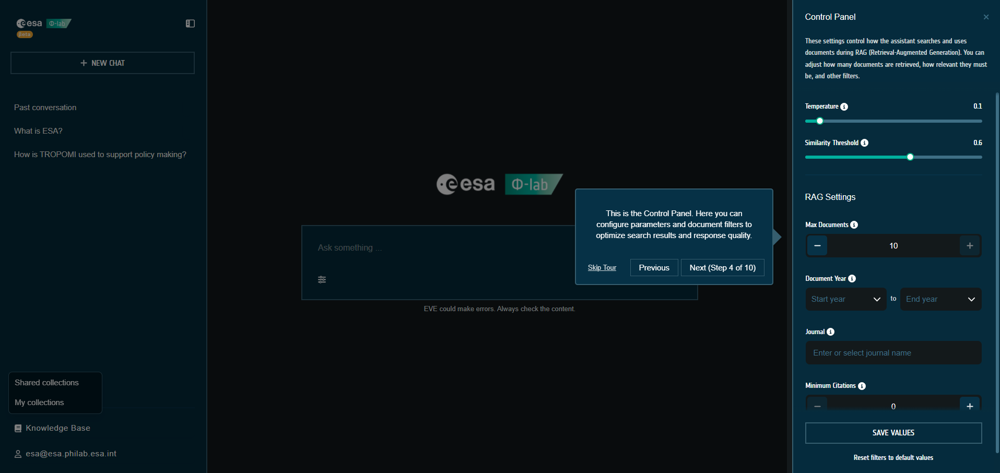

# Control Panel

The Control Panel lets you adjust how the assistant retrieves and generates answers (RAG + LLM parameters). Open it from the sliders icon next to the chat input.

## Parameters
- **Temperature**: creativity of the LLM (0 = deterministic, 1 = varied).
- **Similarity threshold**: minimum relevance score for retrieved chunks.
- **Max documents (k)**: number of documents to pass into the answer.
- **Year range**: restrict document publication years.
- **Journal filter**: limit retrieval to a specific journal.
- **Topic filters**: thematic, scientific/technical, and market perspectives (hidden when `VITE_HIDE_CLASSIFICATION_FILTERS=true`).
- **Minimum citations**: require a minimum citation count.

## Persistence & defaults
- Settings are stored in the browser’s `localStorage` per user/device.
- Click **Save values** to persist changes.
- Use **Reset filters to default values** to restore the defaults.

