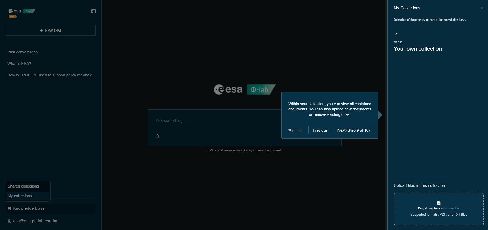

# Private Collections

Private collections are your own document sets stored in the vector database (Qdrant) and used for Retrieval-Augmented Generation in your chats.

## Create and manage
1. Open the **Knowledge Base** menu in the left sidebar and choose **My collections**.
2. Click **NEW COLLECTION** and provide a name.
3. Select a collection to view its documents; delete the collection if you no longer need it.

## Upload documents
- Supported formats: **PDF** and **TXT**.
- Use drag & drop or click to browse files in the upload area for the selected collection.
- Uploaded files are embedded into Qdrant; relevant chunks will be pulled into chat answers when applicable.
- You can delete individual documents you own.

## Tips
- Keep uploads focused on the topics you’ll query for better retrieval quality.
- After uploading, send a new message to allow the assistant to use the fresh context.

